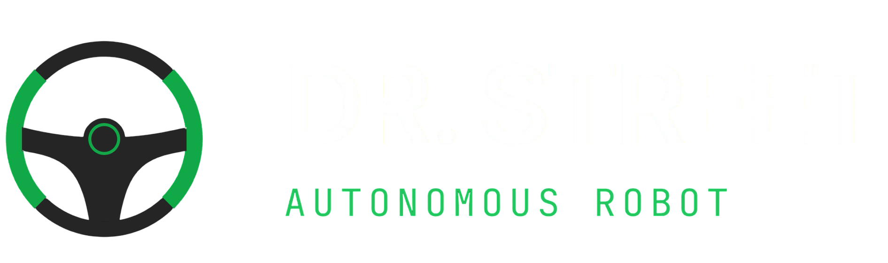
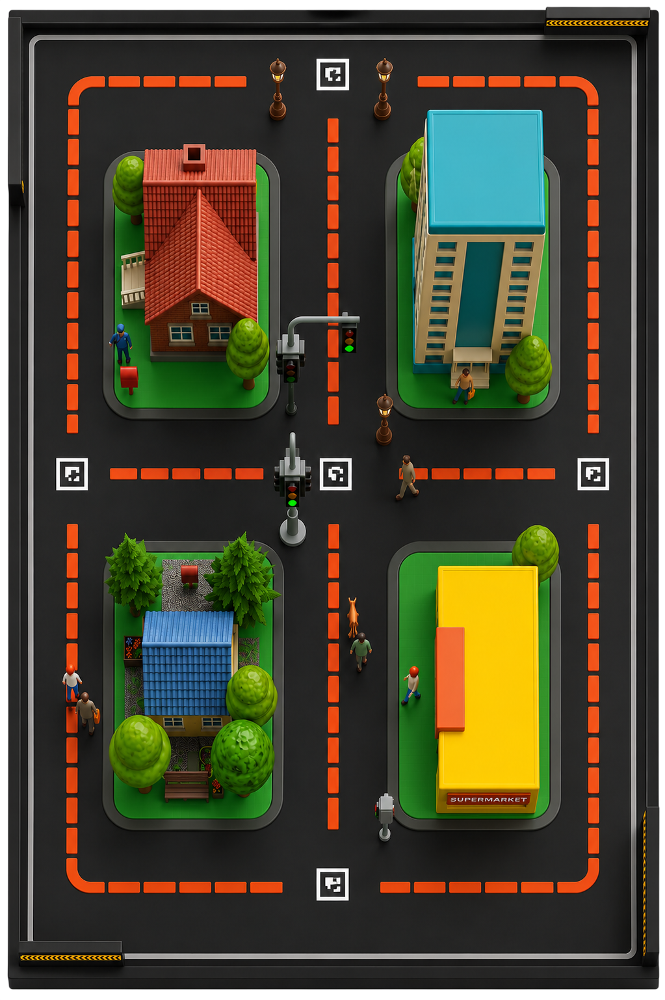

<p align="center">
  
</p>

<p align="center">
  <a href="https://drstreet.vercel.app/"></a>
  
  
  
  
</p>

# Dr.Street Autonomous Robot

A complete, hands-on ROS 2 robotics project for learning autonomous navigation, computer vision, and embedded systems.

This guide is designed for **university students and beginners** and covers everything from system setup to running autonomous lane-following code. For the comprehensive operation manual, please visit our [Official Documentation](https://drstreet.vercel.app/).

---

## Table of Contents

1. [Project Overview](#project-overview)
2. [What You'll Learn](#what-youll-learn)
3. [Prerequisites & Requirements](#prerequisites--requirements)
4. [Hardware Assembly & Wiring](#hardware-assembly--wiring)
5. [Part 1: Ubuntu Server Setup](#part-1-ubuntu-server-setup)
6. [Part 2: Understanding the Standalone Python Script](#part-2-understanding-the-standalone-python-script)
7. [Part 3: ROS 2 Jazzy Installation](#part-3-ros-2-jazzy-installation)
8. [Part 4: Building the ROS 2 Project](#part-4-building-the-ros-2-project)
9. [Part 5: Running the Robot](#part-5-running-the-robot)
10. [Project Architecture](#project-architecture)
11. [Troubleshooting](#troubleshooting)
12. [Next Steps](#next-steps)
13. [References](#references)

---

## Project Overview

The Dr.Street project is an **autonomous mobile robot** that:

- **Detects red lane markings** using a USB camera and OpenCV (computer vision)
- **Recognizes ArUco junction markers** to decide where to turn
- **Controls motors** via serial communication with an ESP32 microcontroller
- **Demonstrates core robotics concepts**: perception, decision-making, and actuation

### Technology Stack

<p align="center">
  <a href="https://www.ros.org/"></a>
  &nbsp;&nbsp;&nbsp;&nbsp;
  <a href="https://opencv.org/"></a>
  &nbsp;&nbsp;&nbsp;&nbsp;
  <a href="https://www.python.org/"></a>
  &nbsp;&nbsp;&nbsp;&nbsp;
  <a href="https://ubuntu.com/"></a>
  &nbsp;&nbsp;&nbsp;&nbsp;
  <a href="https://www.raspberrypi.org/"></a>
</p>

### Two Approaches to This Project

1. **Standalone Python** (`followlaneesp.py`) — Simple, no dependencies, runs directly on the robot
2. **ROS 2** (main project) — Professional framework, modular, scalable architecture

We'll learn both!

---

## Simulation Environment

<p align="center">
  
</p>

The project includes a robust simulation environment to test vision algorithms and autonomy features before deploying to physical hardware.

---

## What You'll Learn

By completing this project, you will understand:

- **Linux fundamentals** — navigating terminals, package management
- **Python programming** — OpenCV, computer vision algorithms
- **ROS 2 framework** — nodes, launch files, package structure
- **Robotics concepts** — perception, control, state machines
- **Debugging & troubleshooting** — reading error messages, diagnosing issues
- **Git workflow** — version control for engineering projects
- **Embedded systems** — serial communication, real-time constraints

---

## Prerequisites & Requirements

### Hardware

- **Raspberry Pi 4** (8GB recommended) or similar Ubuntu-compatible computer
- **USB camera** (Logitech C110 or compatible)
- **ESP32 microcontroller** (or similar with motor driver)
- **Motors** (with encoders, optional)
- **Power supply** (appropriate for your hardware)

### Software

- Ubuntu 24.04 LTS (server or desktop)
- Python 3.10+
- ROS 2 Jazzy
- Git
- Basic terminal knowledge

### Network

- Internet connection (for installation)
- SSH access (if using Raspberry Pi remotely)

---

## Hardware Assembly & Wiring

This section covers the physical assembly, connections, and wiring of the Dr.Street robot. The project supports two primary hardware control architectures:

*   **Option A: ESP32 Serial Co-Processor (Default / Recommended)**: The Raspberry Pi handles high-level computer vision and ROS 2 processing, sending motor commands over serial UART to an ESP32 microcontroller, which directly controls the motor driver.
*   **Option B: Direct Raspberry Pi GPIO Control**: The Raspberry Pi controls the motor driver directly via GPIO pins using `gpiozero` (bypassing the ESP32 co-processor).

---

### Option A: ESP32 Serial Co-Processor Configuration

This architecture splits the workload: the Raspberry Pi runs the heavy computer vision algorithms, and the ESP32 acts as a real-time motor controller.

#### 1. Wiring & Pin Mappings
Connect the Raspberry Pi, ESP32, and the motor driver (e.g., L298N or similar dual H-bridge) as follows:

| Connection Source | Source Pin | Connection Destination | Destination Pin | Description |
| :--- | :--- | :--- | :--- | :--- |
| **Raspberry Pi** | GPIO 14 (TXD) | **ESP32** | RX0 (GPIO 3) | Serial TX to RX |
| **Raspberry Pi** | GPIO 15 (RXD) | **ESP32** | TX0 (GPIO 1) | Serial RX to TX |
| **Raspberry Pi** | GND | **ESP32** | GND | Reference ground |
| **ESP32** | GPIO 14 (OUT) | **Motor Driver** | IN1 (Right Motor Forward) | Right Motor forward signal |
| **ESP32** | GPIO 15 (OUT) | **Motor Driver** | IN2 (Right Motor Backward) | Right Motor backward signal |
| **ESP32** | GPIO 12 (OUT) | **Motor Driver** | IN3 (Left Motor Forward) | Left Motor forward signal |
| **ESP32** | GPIO 13 (OUT) | **Motor Driver** | IN4 (Left Motor Backward) | Left Motor backward signal |
| **Motor Driver** | OUT1 / OUT2 | **Right Motor** | +/- | Right motor terminals |
| **Motor Driver** | OUT3 / OUT4 | **Left Motor** | +/- | Left motor terminals |

> [!CAUTION]
> **Common Ground**: Ensure a common ground pin connects the Raspberry Pi GND, ESP32 GND, and Motor Driver GND. Without a shared ground reference, serial communication packets will be corrupted, and the motors will run erratically or not at all.

> [!TIP]
> **USB UART Disconnection**: Since the ESP32's primary hardware Serial port (`RX0`/`TX0` on pins 3/1) is shared with the onboard USB programming chip, you may need to temporarily disconnect the RX/TX wires between the Raspberry Pi and the ESP32 while uploading code from your computer to avoid programming conflicts.

#### 2. ESP32 Firmware (Arduino Sketch)
Upload the following firmware to your ESP32. It listens on the hardware `Serial` port (`115200` baud) for motor command packets formatted as `left_speed,right_speed\n` (range: `-255` to `255`), parses them, and drives the motors using PWM.

```cpp
#include <Arduino.h>

// Define your motor pins
const int LEFT_F = 12; 
const int LEFT_B = 13;
const int RIGHT_F = 14; 
const int RIGHT_B = 15;

// PWM configuration
const int freq = 5000;
const int res = 8; // 8-bit resolution (0-255)

void setup() {
  Serial.begin(115200);

  // Initialize channels 0-3
  ledcSetup(0, freq, res);
  ledcSetup(1, freq, res);
  ledcSetup(2, freq, res);
  ledcSetup(3, freq, res);

  // Attach pins to channels
  ledcAttachPin(LEFT_F, 0);
  ledcAttachPin(LEFT_B, 1);
  ledcAttachPin(RIGHT_F, 2);
  ledcAttachPin(RIGHT_B, 3);
}

void loop() {
  if (Serial.available() > 0) {
    // Read command string until newline
    String data = Serial.readStringUntil('\n');
    int commaIndex = data.indexOf(',');
    
    if (commaIndex > 0) {
      int left = data.substring(0, commaIndex).toInt();
      int right = data.substring(commaIndex + 1).toInt();
      
      // Update PWM signals
      // Forward if speed is positive, reverse if negative
      ledcWrite(0, (left > 0) ? left : 0);
      ledcWrite(1, (left < 0) ? abs(left) : 0);
      ledcWrite(2, (right > 0) ? right : 0);
      ledcWrite(3, (right < 0) ? abs(right) : 0);
    }
  }
}
```

> [!NOTE]
> **Symmetric vs. Mirrored Command Formats**: The ROS 2 perception node (`followlaneesp_node.py`) swaps the left and right values before transmitting to account for motor mirror configurations (e.g. `actual_left = right`, `actual_right = left`). Keep this in mind when mapping your motor connections.

---

### Option B: Direct Raspberry Pi GPIO Configuration

For a simpler build without an ESP32 co-processor, you can connect the motor driver directly to the Raspberry Pi GPIO headers. The `ds_motor` ROS 2 package (`motor_node.py`) is preconfigured for this setup using `gpiozero`.

#### Pin Mappings (BCM)

| Raspberry Pi Pin (BCM) | Motor Driver Pin | Description |
| :--- | :--- | :--- |
| **GPIO 20** | IN1 (Right Motor Forward) | Right Motor Forward PWM |
| **GPIO 21** | IN2 (Right Motor Backward) | Right Motor Backward PWM |
| **GPIO 16** | IN3 (Left Motor Forward) | Left Motor Forward PWM |
| **GPIO 12** | IN4 (Left Motor Backward) | Left Motor Backward PWM |
| **GND** | GND | Common reference ground |

---

### Power Distribution & System Safety

To build a reliable robot and protect your hardware:

1.  **Dual Power Isolation**: DC motors generate inductive kickback and electrical noise that can cause the Raspberry Pi or ESP32 to brown out or reset. Power the Raspberry Pi with a dedicated power bank or high-quality buck converter, and power the motors using a separate battery pack (e.g. 7.4V Li-ion or 11.1V LiPo).
2.  **Logic Level Verification**: The Raspberry Pi and ESP32 operate on 3.3V logic levels. Ensure that your motor driver inputs can accept 3.3V logic signals (most standard L298N drivers accept 3.3V/5V logic input, so they can be driven directly).
3.  **Emergency Shutoff**: Always place a physical power switch on the motor power rail so you can immediately disable the motors if the autonomous code behaves unexpectedly.

---

## Part 1: Ubuntu Server Setup

This section assumes you're starting from a fresh Ubuntu 24.04 installation.

### 1.1 Initial System Update

Open a terminal and update the package list and installed packages:

```bash
sudo apt update
sudo apt upgrade -y
```

This ensures all system packages are current and secure.

### 1.2 Install Essential Development Tools

```bash
sudo apt install -y \
  build-essential \
  cmake \
  git \
  wget \
  curl \
  python3 \
  python3-pip \
  python3-dev \
  vim \
  nano
```

This installs:
- `build-essential` — C/C++ compilers and tools
- `cmake` — build system
- `git` — version control
- `python3-pip` — Python package manager
- `vim`, `nano` — text editors

### 1.3 Install Python Dependencies

```bash
python3 -m pip install --upgrade pip
python3 -m pip install --user \
  opencv-python \
  numpy \
  pyserial
```

These are the core libraries:
- **opencv-python** — computer vision (lane detection)
- **numpy** — numerical computing
- **pyserial** — serial communication with ESP32

### 1.4 Verify Your Setup

```bash
python3 --version
pip3 --version
git --version
gcc --version
```

All commands should return version numbers without errors.

### 1.5 Configure Git (Important!)

Git needs to know who you are:

```bash
git config --global user.name "Your Name"
git config --global user.email "your.email@university.edu"
```

---

## Part 2: Understanding the Standalone Python Script

Before jumping into ROS 2, let's understand `followlaneesp.py` — the core algorithm.

### 2.1 What It Does

The script implements **autonomous lane following**:

1. **Capture** — reads frames from a USB camera
2. **Detect** — finds red lane markings using HSV color filtering
3. **Process** — calculates steering angle via proportional-derivative (PD) control
4. **Detect Junctions** — recognizes ArUco markers for navigation decisions
5. **Control** — sends motor commands to the ESP32 over serial

### 2.2 Key Concepts

#### Color Detection (HSV)

Instead of using RGB, the script converts frames to **HSV** (Hue, Saturation, Value):
- More robust to lighting changes than RGB
- Easy to isolate specific colors (red, green, blue)

#### PID Control

The robot uses a **PD controller** (Proportional-Derivative) to steer:

```
steering = (STEER_GAIN × error) + (STEER_D × error_derivative)
```

- **error** — deviation from center
- **STEER_GAIN** — how aggressively to steer
- **STEER_D** — damping (smooth vs. jerky)

#### ArUco Markers

QR-code-like markers that the robot recognizes to:
- Detect junctions (stop points)
- Make navigation decisions (turn left/right)

### 2.3 Running the Standalone Script

> [!WARNING]
> This script connects directly to the motor hardware. Use in a safe environment!

```bash
cd /home/pi/ak_ws/src/ds
python3 followlaneesp.py
```

### 2.4 Understanding the Code

Key sections of `followlaneesp.py`:

**Motor Control:**
```python
def set_motor(right, left):
    # Converts steering values to ESP32 PWM commands
    # Sends over serial port /dev/ttyS0
```

**Lane Detection:**
```python
def has_red_lane(frame):
    # Converts frame to HSV
    # Masks red colors
    # Returns True if lane is visible
```

**Ackermann Turns:**
```python
def turn_until_red(direction):
    # Smooth turning arc (like a car, not a tank)
    # Searches until lane is found again
```

---

## Part 3: ROS 2 Jazzy Installation

ROS 2 is a robotics **middleware** that helps you:
- Build modular, reusable components
- Manage complex robot systems
- Debug and visualize robot behavior

### 3.1 Add ROS 2 Repository

```bash
sudo curl -sSL https://repo.ros2.org/ros.key -o /usr/share/keyrings/ros-archive-keyring.gpg
echo "deb [arch=$(dpkg --print-architecture) signed-by=/usr/share/keyrings/ros-archive-keyring.gpg] http://repo.ros2.org/ubuntu $(. /etc/os-release && echo $UBUNTU_CODENAME) main" | sudo tee /etc/apt/sources.list.d/ros2.list > /dev/null
```

### 3.2 Update Package List

```bash
sudo apt update
```

### 3.3 Install ROS 2 Jazzy

```bash
sudo apt install -y ros-jazzy-desktop
```

This installs:
- Core ROS 2 libraries
- `colcon` build tool
- `ros2` CLI utilities
- visualization tools

### 3.4 Source ROS 2 (Important!)

Every terminal session must source ROS 2:

```bash
source /opt/ros/jazzy/setup.bash
```

To do this automatically, add it to your `.bashrc`:

```bash
echo "source /opt/ros/jazzy/setup.bash" >> ~/.bashrc
source ~/.bashrc
```

### 3.5 Verify ROS 2 Installation

```bash
ros2 --version
```

Should output: `release-jazzy-...`

### 3.6 Install colcon (Build Tool)

```bash
sudo apt install -y python3-colcon-common-extensions
```

---

## Part 4: Building the ROS 2 Project

### 4.1 Clone or Navigate to the Repository

```bash
cd /home/pi/ak_ws/src/ds
```

(Or clone if you don't have it yet):

```bash
git clone https://github.com/akhiljithvg/ds.git
cd ds
```

### 4.2 Understand the Project Structure

```
ds/
├── README.md                      # This file
├── followlaneesp.py              # Standalone lane-following script
├── ds_bringup/               # ROS 2 launch configurations
│   ├── launch/
│   │   └── bringup.launch.py     # Main launch file
│   └── setup.py
├── ds_perception/            # Vision & lane detection
│   ├── ds_perception/
│   │   └── followlaneesp_node.py # ROS 2 wrapper around lane following
│   └── setup.py
├── ds_motor/                 # Motor control
├── ds_safety/                # Safety watchdog
└── ds_simulation/            # Gazebo simulation
```

### 4.3 Source ROS 2 and Build

```bash
# Source ROS 2
source /opt/ros/jazzy/setup.bash

# Navigate to the workspace root (one level above src/)
cd /home/pi/ak_ws

# Build the Dr.Street packages
colcon build --packages-select ds_perception ds_bringup

# Source the build output
source install/setup.bash
```

### 4.4 What Happened?

`colcon build`:
- Compiles ROS 2 packages
- Resolves dependencies
- Creates the `install/` directory with executable nodes

Sourcing `install/setup.bash`:
- Makes the newly built nodes available to `ros2 run` and `ros2 launch`

### 4.5 Verify Build Success

```bash
ros2 pkg list | grep ds
```

Should list:
- `ds_bringup`
- `ds_perception`
- `ds_motor`
- `ds_safety`
- `ds_simulation`

---

## Part 5: Running the Robot

### 5.1 Launch with ROS 2

The recommended way to start all nodes:

```bash
ros2 launch ds_bringup bringup.launch.py
```

This:
- Starts the perception node (camera + lane following)
- Sends motor commands to the ESP32
- Activates safety monitoring

### 5.2 Run a Single Node

To run just the perception node (for debugging):

```bash
ros2 run ds_perception followlaneesp_node
```

### 5.3 Expected Behavior

Once running, the robot should:

1. **Initialize** — open camera, connect to ESP32, log startup messages
2. **Process frames** — read camera 30 times per second
3. **Detect lanes** — convert frames to HSV, find red pixels
4. **Steer** — calculate motor commands based on lane position
5. **Pause on ArUco** — stop for 1 second when a junction marker is detected
6. **Execute action** — turn left/right or go straight

### 5.4 Monitoring the Robot

In another terminal, check ROS 2 topics:

```bash
ros2 topic list
ros2 topic echo /cmd_motor
```

This shows what commands are being sent to the motors.

---

## Project Architecture

### Data Flow

```
USB Camera
    ↓ (raw frames)
perception_node (followlaneesp_node)
    ↓ (processes vision, detects lanes/markers)
    ↓
motor commands (PWM values)
    ↓
ESP32 (serial UART)
    ↓
Motor Driver
    ↓
Motors (left + right)
```

### ROS 2 Node Graph

```
camera → followlaneesp_node → motor_driver → motors
                ↓
          (internal loop @ 30Hz)
          - detect red lane
          - detect ArUco
          - calculate steering
          - send motor commands
```

### Key Parameters (Tunable)

Edit `ds_perception/ds_perception/followlaneesp_node.py`:

```python
BASE_SPEED = 40          # Motor speed when following lane
STEER_GAIN = 0.50        # How aggressively to steer
STEER_D = 0.60           # Damping (reduces oscillations)
APPROACH_SPEED = 15      # Speed when near junction
ARUCO_TRIGGER_AREA = 1500 # Pixel area to trigger junction action
```

Lower `STEER_GAIN` → smoother, wider turns  
Higher `STEER_GAIN` → sharper, tighter turns  

---

## Troubleshooting

### Camera Issues

**Problem:** `Camera read failed` in logs

**Solutions:**
```bash
# List available cameras
ls -la /dev/video*

# Check camera permissions
v4l2-ctl --list-devices

# Test with OpenCV
python3 -c "import cv2; cap = cv2.VideoCapture(0); print(cap.isOpened())"
```

### Serial Connection Issues

**Problem:** `Failed to open serial port: /dev/ttyS0`

**Solutions:**
```bash
# List serial ports
ls -la /dev/tty*

# Check permissions
sudo usermod -a -G dialout $USER
# Log out and back in

# Test serial connection
python3 -m serial.tools.list_ports
```

### ROS 2 Node Missing

**Problem:** `Could not find executable 'followlaneesp_node'`

**Solution:**
```bash
# Make sure you sourced the build output
source /home/pi/ak_ws/install/setup.bash

# Verify the node exists
ros2 pkg executables ds_perception
```

### Build Errors

**Problem:** `CMake Error` or missing dependencies

**Solution:**
```bash
# Install missing ROS 2 packages
sudo apt install -y ros-jazzy-cv-bridge ros-jazzy-launch-ros

# Clean and rebuild
colcon build --packages-select ds_perception ds_bringup --force-cmake-configure
```

### Motor Not Moving

**Problem:** Robot is running but not moving

**Checklist:**
- [ ] ESP32 is powered on
- [ ] USB camera is working (test with `followlaneesp.py`)
- [ ] Serial port `/dev/ttyS0` is accessible
- [ ] Motor driver is connected and powered
- [ ] Lane (red marking) is visible in camera frame

---

## Next Steps

### 1. Modify the Code

Try adjusting these parameters in `followlaneesp_node.py`:

```python
# Make the robot faster/slower
BASE_SPEED = 60  # Increase from 40

# Make steering more responsive
STEER_GAIN = 0.80  # Increase from 0.50

# Reduce oscillations
STEER_D = 1.0  # Increase from 0.60
```

Rebuild and test!

### 2. Add New Features

**Ideas:**
- Obstacle detection (add sonar/lidar)
- Speed control based on lane width
- Logging telemetry to a file
- Gazebo simulation for testing

### 3. Learn ROS 2 Deeper

**Resources:**
- [Official ROS 2 Documentation](https://docs.ros.org/en/jazzy/)
- [ROS 2 Tutorials](https://docs.ros.org/en/jazzy/Tutorials.html)
- [Robot Operating System Course](https://www.udemy.com/course/ros-2-mastery/)

### 4. Explore Robotics

**Concepts to study:**
- SLAM (Simultaneous Localization and Mapping)
- Path planning (Dijkstra, A*)
- Machine learning for vision
- Real-time control theory

---

## References

### Documentation

- [ROS 2 Jazzy Official Docs](https://docs.ros.org/en/jazzy/)
- [OpenCV Python Tutorials](https://docs.opencv.org/4.x/d6/d00/tutorial_py_root.html)
- [Python Serial Communication](https://pyserial.readthedocs.io/)

### Tutorials

- **ROS 2 Basics:** Creating nodes, launch files, topics
- **OpenCV Vision:** Color spaces (HSV), morphological operations, contours
- **Control Theory:** PID/PD controllers for robotics

### Hardware References

- **ESP32 Serial Protocol:** Check your motor driver's documentation
- **Raspberry Pi GPIO:** Not used in this project (using serial instead)
- **USB Camera:** Standard V4L2 interface

---

## Tips for Students

### 1. Read Error Messages Carefully

When something breaks, read the full error output. It usually tells you exactly what went wrong.

### 2. Use Print Statements

Add debug output to understand what's happening:

```python
self.get_logger().info(f"Lane detected at x={cX}, steering={steer}")
```

### 3. Start Small

Test each component separately:
- Camera alone
- Lane detection on a static image
- Motor commands in isolation

### 4. Document Your Changes

Use Git commits to track what you change:

```bash
git add followlaneesp_node.py
git commit -m "Increase steering gain from 0.5 to 0.8 for sharper turns"
```

### 5. Ask for Help

- Check the [troubleshooting section](#troubleshooting) first
- Search existing GitHub issues
- Ask on ROS Answers or Stack Overflow

---

## License

This project is provided as-is for educational purposes. No license is included; add one if you plan to share or distribute.

---

## Questions?

If you have questions or find issues:

1. Check this README again (you might have missed something!)
2. Review the troubleshooting section
3. Check the individual package READMEs
4. Ask your instructor or classmates
5. Open an issue on GitHub

---

**Happy robotics learning!**
